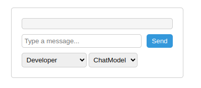
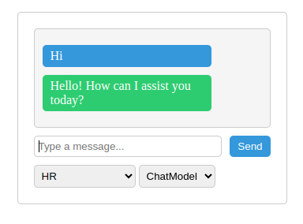

# Chat bot with langchain and openaAI with flask
## 0. Setup & Run
1. Install requirements from `requiremets.txt`
2. Create your OpenAI account on `https://openai.com/` and generate your API key
3. store your `OPENAI_API_KEY = "XXXXXXXXXX"` in `.env` file
4. Run the flask application using `python app.py`

## 1. Working
1. At start-up you'll be presented with :
   1. Persona Selection drop-down box
   2. LLM selection drop-down box (bonus feature)
   
2. Select the persona you want to chat with (you can switch to any in between)

